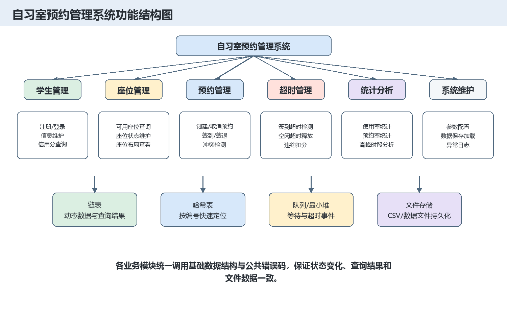
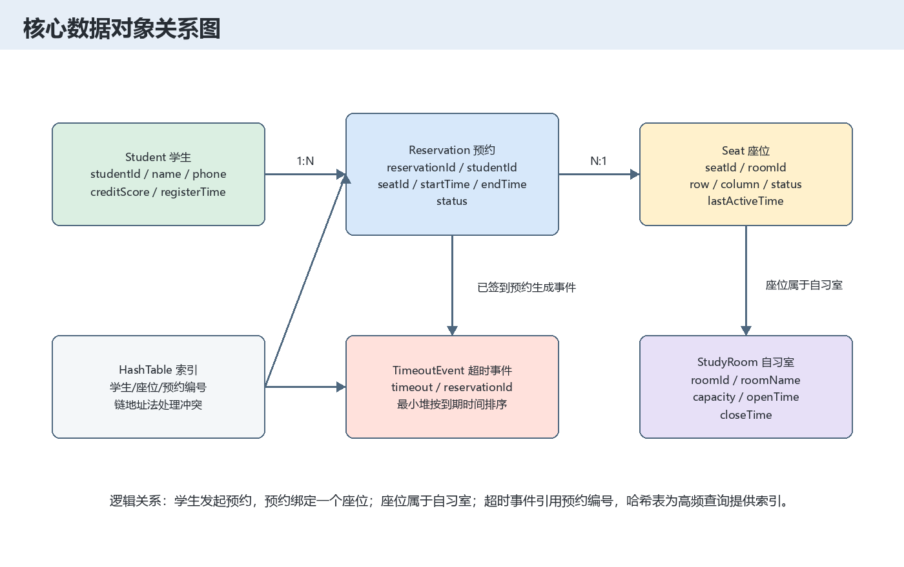
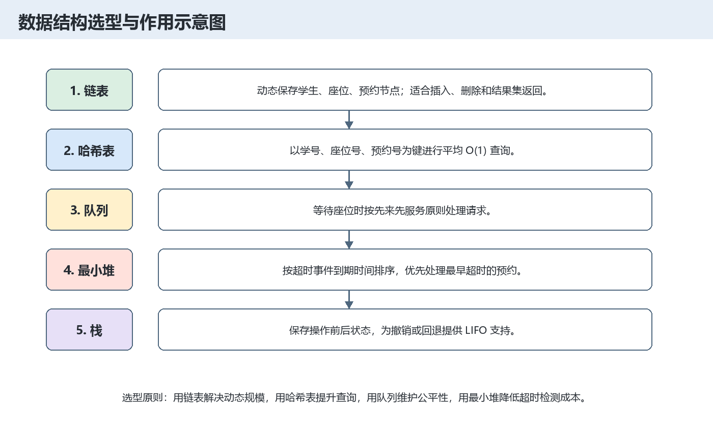
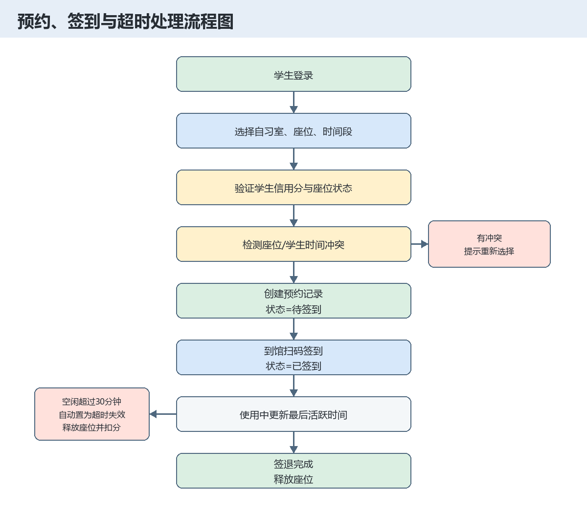
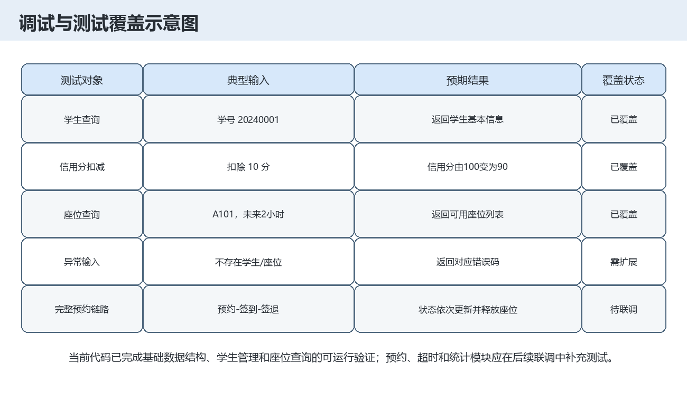

# 自习室预约管理系统综合性实验报告（分析部分）

| 项目 | 内容 |
|---|---|
| 课程名称 | 数据结构与算法课程实践 |
| 实验题目 | 自习室预约管理系统 |
| 小组编号 | 11 |
| 成员 | 徐利杰 0244054；郑林均 0244057；蔡伟杰 0244056 |
| 指导教师 | 李季 |
| 开课学期 | 2025-2026学年第二学期 |

## 目录

- 一、问题描述
- 二、系统分析
  - 1. 用户需求
  - 2. 功能分析
  - 3. 数据结构分析
  - 4. 系统功能封装
- 三、系统设计
- 四、调试与测试
- 五、系统总结与比较分析
- 六、附录

## 一、问题描述

本实验面向高校图书馆自习室预约场景。由于自习室座位资源有限，且在疫情管控或精细化管理要求下需要做到“1人1桌1座”，传统人工登记方式难以及时处理座位查询、预约冲突、签到签退、超时释放和统计分析等问题。因此，本系统计划使用 C 语言和课程中学习的数据结构，设计一个自习室预约管理系统。

系统总体目标是：为学生提供座位查询、预约、签到、签退等服务；为管理人员提供自习室、座位、系统参数和统计数据维护能力；通过哈希表、链表、队列、栈、最小堆等结构提升查询、状态更新和超时处理效率。

## 二、系统分析

### 1. 用户需求（从使用者的视角）

系统使用者可以分为学生用户和管理用户两类。

学生用户的业务需求包括：注册或登录系统，查询指定自习室和时间段内的可用座位，创建预约，取消预约，到馆扫码签到，离馆签退，查看个人预约记录和信用分。学生最关注的是查询结果准确、预约流程清晰、冲突提示及时。

管理用户的业务需求包括：维护自习室与座位基础信息，设置开放时间、签到超时阈值和空闲超时阈值，处理维护中或禁用座位，查看座位使用率、预约成功率、违约统计和高峰时段。管理用户最关注的是数据一致性、异常可追踪和统计结果可用于资源调整。

数据输入需求主要包括学生信息、座位信息、预约时间段、签到签退记录和系统配置；数据输出需求主要包括可用座位列表、预约结果、错误提示、统计报表和测试结果。系统需要持久化保存学生、座位和预约数据，以便程序重启后继续使用。

### 2. 功能分析（从开发者的视角）

按照业务流程，系统可以划分为学生管理、座位管理、预约管理、超时管理、统计分析和系统维护六个模块。学生管理负责用户身份与信用分；座位管理负责座位状态和布局；预约管理负责创建、取消、签到、签退和冲突检测；超时管理负责未签到过期和空闲超时释放；统计分析负责对预约数据进行汇总；系统维护负责参数、文件和异常处理。

核心功能与业务需求的对应关系如下：

| 功能模块 | 主要功能 | 对应业务需求 |
|---|---|---|
| 学生管理 | 注册、登录、信息查询、信用分维护 | 学生身份验证和违约约束 |
| 座位管理 | 可用座位查询、状态维护、布局查看 | 学生选座和管理员维护 |
| 预约管理 | 创建预约、取消预约、签到、签退、冲突检测 | 完成座位使用闭环 |
| 超时管理 | 签到超时、空闲超时、自动释放座位 | 提高座位使用效率 |
| 统计分析 | 使用率、预约率、违约次数、高峰时段 | 辅助管理决策 |
| 系统维护 | 参数配置、数据保存加载、错误处理 | 保证系统稳定运行 |

### 3. 数据结构分析

系统需要处理的主要数据对象包括学生、座位、自习室、预约记录、超时事件和等待请求。

| 数据对象 | 关键数据项 | 逻辑特点 | 基本操作 |
|---|---|---|---|
| Student | 学号、姓名、联系方式、院系、信用分 | 学号唯一，频繁按学号查询 | 新增、查询、修改、扣分 |
| StudyRoom | 自习室编号、名称、容量、位置、开放时间 | 一个自习室包含多个座位 | 新增、修改、停用、查询 |
| Seat | 座位编号、自习室编号、行列、状态、最后活跃时间 | 座位编号唯一，状态随预约变化 | 查询、改状态、生成布局 |
| Reservation | 预约编号、学生、座位、起止时间、签到签退时间、状态 | 同一时间段需检测冲突 | 创建、取消、签到、签退、排序 |
| TimeoutEvent | 超时时间、预约编号 | 按到期时间优先处理 | 入堆、取最早事件、调整堆 |
| WaitQueueNode | 学号、座位号、请求时间 | 按请求先后公平处理 | 入队、出队、查看队首 |

数据元素之间的关系是：一个学生可以拥有多条预约记录；一个座位也可以对应多条不同时间段的预约记录；一个座位属于一个自习室；超时事件通过预约编号引用预约记录。为了提升查找效率，学生、座位和预约记录均建立哈希索引，并使用链地址法处理冲突。

### 4. 系统功能封装

系统采用“数据结构接口 + 业务模块接口”的封装方式。基础接口包括链表、哈希表、队列、栈、最小堆的初始化、插入、查找、删除和销毁操作。业务接口包括学生注册、学生登录、查询可用座位、创建预约、取消预约、签到、签退、超时检查、统计分析和数据保存加载。

函数返回值统一使用 `ErrorCode` 或明确状态值，便于主程序根据返回结果输出提示或执行回滚。例如学生不存在返回 `ERR_STUDENT_NOT_FOUND`，座位不可用返回 `ERR_SEAT_UNAVAILABLE`，时间冲突返回 `ERR_TIME_CONFLICT`，内存申请失败返回 `ERR_MEMORY_ALLOC`。

## 三、系统设计

### 1. UI设计

系统限定为 CLI 纯文本界面。主菜单拟设置为：学生管理、座位查询、预约管理、系统管理、统计分析、退出系统。学生管理子菜单包含注册、登录、查询信息、信用分查询；预约管理子菜单包含创建预约、取消预约、签到、签退、预约记录查询；系统管理子菜单包含自习室维护、座位维护、参数配置和数据保存加载。

### 2. 数据结构设计与实现

物理存储结构选择如下图所示。链表负责动态节点和结果集，哈希表负责高频编号查询，队列负责等待请求，最小堆负责超时事件，栈预留给撤销操作。

持久化方面，当前项目目录中准备了 `students.csv` 和 `seats.csv` 测试数据。后续完整版本可继续扩展 `reservations.csv` 或二进制数据文件，用于保存预约记录和统计结果。

### 3. 算法设计

预约流程以冲突检测为核心：创建预约前先验证学生、信用分、座位状态和时间合法性，再检测同一座位与同一学生在目标时间段内是否已有有效预约。如果无冲突，则创建预约记录并更新座位状态；如果有冲突，则返回错误码并提示重新选择。

时间区间冲突判断采用“两个区间相交”的原则：若新预约开始时间早于已有预约结束时间，且新预约结束时间晚于已有预约开始时间，则认为冲突。超时处理可使用最小堆保存超时事件，系统周期性取出堆顶事件，当事件到期且预约仍处于有效状态时，更新预约状态、释放座位并扣除信用分。

## 四、调试与测试

当前代码目录 `study_room_system_zheng_linjun` 已实现链表、哈希表、学生管理、座位管理和基础测试数据。`main.c` 中的基础测试覆盖了学生查询、信用分扣减和 A101 自习室可用座位查询。

后续联调测试应覆盖：重复预约、同一学生时间冲突、同一座位时间冲突、取消预约、签到超时、空闲超时、维护座位不可预约、数据保存加载失败等异常情况。测试数据应同时包含正常流程和异常流程，保证每项系统分析中提出的功能需求都至少被一个用例覆盖。

## 五、系统总结与比较分析

从功能完备性看，本系统方案覆盖了自习室预约管理的主要业务环节。当前已实现部分集中在基础数据结构、学生和座位模块，为预约模块提供了必要支撑；预约、超时和统计模块仍需在后续联调阶段补齐。

从数据结构有效性看，哈希表适合按学号、座位号和预约号进行快速查询；链表适合动态规模数据；队列适合等待场景；最小堆适合处理按时间排序的超时事件。若与“全部使用数组顺序存储”的方案比较，本方案在动态插入删除和大规模查询上更灵活，但实现复杂度更高，需要更严格的内存释放和错误处理。

## 六、附录

### 1. 小组合作与分工

| 成员 | 角色 | 主要工作 |
|---|---|---|
| 徐利杰 | 组长、系统统筹负责人 | 需求梳理、总体架构、公共类型、系统集成、主菜单和最终文档整理 |
| 郑林均 | 基础数据与座位管理负责人 | 链表、哈希表、学生管理、座位管理、自习室和座位测试数据 |
| 蔡伟杰 | 预约业务与测试负责人 | 预约、签到、签退、超时处理、等待队列、统计分析和测试用例 |

小组协作采用“先统一接口，再并行开发，最后集中联调”的方式。公共结构体、错误码和函数命名由组长统一整理，各成员在对应模块内实现功能，并在合并前完成基础编译和单元测试。

### 2. 成员个人总结和体会

徐利杰：通过本实验进一步理解了需求分析、模块划分和接口统一的重要性。数据结构课程实践不只是写出单个算法，还要让多个结构服务于完整系统。

郑林均：负责基础数据和座位管理时，体会到哈希表、链表和错误码封装对后续业务模块的支撑作用。只有基础接口稳定，预约和统计功能才能顺利调用。

蔡伟杰：预约、超时和测试部分需要重点关注状态变化和边界条件。时间冲突、未签到过期、空闲超时等场景都体现了算法设计与业务规则结合的重要性。
